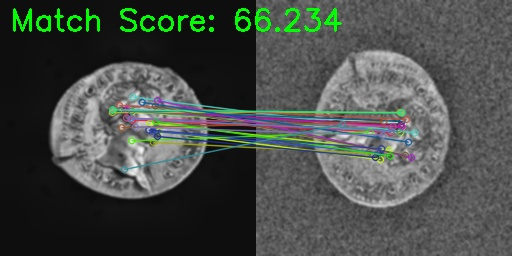

# Coin Image Matching System



This project uses the Harvard Art Museums API to fetch coin images and match them with local images using computer vision techniques. It implements feature detection, matching, and visualization to help identify similar coins.

## Project Overview

The Coins Recovery Project aims to leverage modern technology to assist the Harvard Art Museums in locating coins that were stolen from the Fogg Museum’s Coin Room in December 1973. Although a large portion of the collection has been recovered, many coins remain missing. The project seeks to identify and recover additional stolen coins with computer techniques.

Previous phases have:

- Built an inventory of missing coins with available descriptions and images.
- Tested basic image comparison and data enrichment methods.

## Project Objectives

- Develop a functional, automatable pipeline to identify potentially recovered coins from online sources.
- Implement robust image segmentation to extract coin fronts and backs from auction images.
- Perform feature extraction and image matching between missing coins and newly discovered images.
- Conduct statistical analysis to evaluate matching confidence levels.
- Integrate the system into a bot that can continuously update results.

## Features

- Fetches coin images from Harvard Art Museums API
- Preprocesses images with basic techniques:
  - Split front and back of coins for api images
  - Denoising
  - Contrast enhancement
  
- Implements feature extraction and matching algorithms:
  - ORB (Oriented FAST and Rotated BRIEF) -> feature extraction
  - FLANN ( Fast Library for Approximate Nearest Neighbors) -> perform feature matching between two images
  - Homography method to find transformation between two images -> verify the geometric consistency of matches
  - Similarity Scoring -> similarity measure between coin images
- Provides detailed match visualization:
  - Feature point matching visualization
  - Score distribution plots
  - Best matches summary
- Stores and reads results in SQLite database

## Installation

1. Clone the repository:
```bash
git clone https://github.com/Spectual/Coins-Recovery-demo.git
cd Coins-Recovery-demo
```

2. Install dependencies:
```bash
pip install -r requirements.txt
```

## Usage

1. Place your testing coin images in the `data/missing_images` directory.

2. Run the main script:
```bash
python main.py --api-key YOUR_API_KEY
```

## Project Structure

```
.
├── main.py              # Main script
├── requirements.txt   
├── README.md          
├── data/
│   ├── api_images/     # Images from Harvard API
│   └── missing_images/ # Images to match
├── results/            # Output directory
│   ├── processed_api/  
│   ├── processed_missing/ 
│   ├── visualizations/ # Matching visualizations
│   └── results.json    # Matching result
└── src/
    ├── data_fetcher.py    # Fetch images
    ├── image_processor.py # Image preprocessing
    ├── feature_matcher.py # Feature matching
    ├── save_result.py    # Database operations
    └── visualizer.py     # Result visualization
```

### Command Line Arguments

- `--api-key`: Harvard Art Museums API key (required)
- `--db-path`: Path to SQLite database (default: "coin_matches.db")
- `--api-images-dir`: Directory for API images (default: "data/api_images")
- `--missing-images-dir`: Directory for missing images (default: "data/missing_images")
- `--output-dir`: Directory for results (default: "results")
- `--max-items`: Maximum number of items to fetch (default: 20)
- `--match-threshold`: Minimum match score threshold (default: 0.3)
- `--skip-fetch`: Skip fetching images from API

## Output

The system generates several outputs:

1. Processed Images:
   - `results/processed_api/`: Processed API images
   - `results/processed_missing/`: Processed missing images

2. Visualizations:
   - `results/visualizations/`: Match visualizations
   - `results/visualizations/score_distribution.png`: Score distribution plot

3. Results:
   - `results/results.json`: Detailed matching results
   - `coin_matches.db`: SQLite database with all matches

